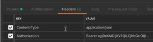

## Welcome to NvIAPM
NvIPAM is an opensource IPAM, DNS, and CMDB solution based on flask restplus.

Unlike legacy IPAM solutions, this one is built from the ground up to be vSphere network aware.  

The original plan was to leverage map the networks from vRealize Automation (vRA) reservation to the selected network.  However after diving into the IPAM SDK it was determined the networks were not being passed in as a variable.
The workaround (for now) is to map the network name to the pool name to help identify the correct pool when you create a new vRA Network Profile.

It offers the following features;

* Swagger API
* 
* DNS Authorative and Recursor services leverging PowerDNS
* Basic CMDB
* vRealize Automation (vRA) 7.x IPAM endpoint and external network IPAM workflow package
* vRA Event Broker Service (EBS) DNS Create and Delete A record workflows
* vRA EBS CMDB Add and Update CMDB record
* 
* vCenter IPAM Integration 
* 
* PowerShell / PowerCLI to capture the vCenter networks to facilitate populating the database.
* PostgreSQL backend

### External software

This project uses [PowerDNS](https://www.powerdns.com/) authorative and recursor to provide delegate or authoritative DNS for a develop environment.

#### Installation

Deploy or create a CentOS 7 machine using the minimum install.

The requirements for this project can be install using an Ansible playbook, available at [NvIPAM-Ansible-Install] (https://github.com/kovarus/NvIPAM-Ansible-Install).

`yum install -y ansible git`

`ssh-keygen`

`ssh-copy-id root@localhost`

`git clone https://github.com/kovarus/NvIPAM-Ansible-Install.git`

`cd NvIPAM-Ansible-Install`

`ansible-galaxy install -r requirements.yml`

`ansible-playbook -i hosts site.yml`

### Post installation steps

You will need to initialize the DB after the installation, then restart/start the services

`su - nvipam`

`cd nvipam`

`source venv/bin/activate`

Initialize the db using Flask Migrate

`flask db init`

**Important**

This env.py file excludes the previously created PowerDNS tables.

`copy env.py migrations/env.py`

`flask db migrate`

`flask db upgrade`

Return to root

`exit`

`systemctl enable nvipam.service`

`systemctl start nvipam.service`

`systemctl restart nginx.service`

Open the browser by entering http://{host ip or fqdn}:5000/api/1.0

Default username & password is `admin` & `VMware1!`
The response will look like this { "message": "Logged in as admin","bearer_token": "eyJ0eXAiOiJKV1QiLCJhbGciO......}

## Header Authentication ##

You will need to add an Authentication Header of Bearer with token retrieved from the previous REST Call.

### License
BSD 3-Clause License

Copyright (c) 2019, Kovarus
All rights reserved.

Redistribution and use in source and binary forms, with or without
modification, are permitted provided that the following conditions are met:

* Redistributions of source code must retain the above copyright notice, this
  list of conditions and the following disclaimer.

* Redistributions in binary form must reproduce the above copyright notice,
  this list of conditions and the following disclaimer in the documentation
  and/or other materials provided with the distribution.

* Neither the name of the copyright holder nor the names of its
  contributors may be used to endorse or promote products derived from
  this software without specific prior written permission.

THIS SOFTWARE IS PROVIDED BY THE COPYRIGHT HOLDERS AND CONTRIBUTORS "AS IS"
AND ANY EXPRESS OR IMPLIED WARRANTIES, INCLUDING, BUT NOT LIMITED TO, THE
IMPLIED WARRANTIES OF MERCHANTABILITY AND FITNESS FOR A PARTICULAR PURPOSE ARE
DISCLAIMED. IN NO EVENT SHALL THE COPYRIGHT HOLDER OR CONTRIBUTORS BE LIABLE
FOR ANY DIRECT, INDIRECT, INCIDENTAL, SPECIAL, EXEMPLARY, OR CONSEQUENTIAL
DAMAGES (INCLUDING, BUT NOT LIMITED TO, PROCUREMENT OF SUBSTITUTE GOODS OR
SERVICES; LOSS OF USE, DATA, OR PROFITS; OR BUSINESS INTERRUPTION) HOWEVER
CAUSED AND ON ANY THEORY OF LIABILITY, WHETHER IN CONTRACT, STRICT LIABILITY,
OR TORT (INCLUDING NEGLIGENCE OR OTHERWISE) ARISING IN ANY WAY OUT OF THE USE
OF THIS SOFTWARE, EVEN IF ADVISED OF THE POSSIBILITY OF SUCH DAMAGE.

### Support or issues

Please look at the [wiki page] (https://github.com/kovarus/NvIPAM/wiki) or submit an [issue] (https://github.com/kovarus/NvIPAM/issues)